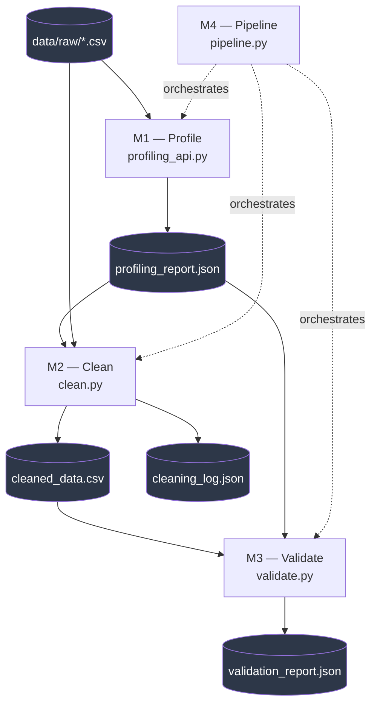

# Automated Data Quality & Validation System

A backend **"data gatekeeper"** that profiles, cleans, validates, and scores any
dataset before it is used for analysis — so unreliable data never drives faulty
insights.

Built as part of the **CadetX Virtual Work Experience** programme.

---

## The problem

Most raw data entering a business is messy, inconsistent, or incomplete. Bad data
leads to bad decisions. This system automatically checks data quality *before* the
data reaches any downstream report or model.

## Architecture

Four modules, each reading the previous one's output as its input (a
"file contract"), so every stage is independently runnable and testable.



| Module | Purpose | Output | README |
|--------|---------|--------|--------|
| **M1 — Profile** | Understand the dataset: types, missing values, distributions, correlation, cardinality, PII flags | `profiling_report.json` | [modules/m1_profiling](modules/m1_profiling/README.md) |
| **M2 — Clean** | Fix it: impute missing values, remove duplicates, normalise formats, score quality before/after | `cleaned_data.csv`, `cleaning_log.json` | [modules/m2_cleaning](modules/m2_cleaning/README.md) |
| **M3 — Validate** | Check it: rule-based validation (formats, ranges, categories) + Isolation Forest anomaly detection; overall health score | `validation_report.json` | [modules/m3_validation](modules/m3_validation/README.md) |
| **M4 — Pipeline** | Chain M1→M2→M3 into one fail-fast, single-command run | all of the above | [modules/m4_pipeline](modules/m4_pipeline/README.md) |

---

## How to run

```bash
# 1. Set up environment
python -m venv venv
source venv/bin/activate        # Windows: venv\Scripts\activate
pip install -r requirements.txt

# 2. Drop your dataset into data/raw/  (e.g. data/raw/broadband_customers.csv)

# 3. Run the full pipeline (one command: M1 -> M2 -> M3)
python modules/m4_pipeline/pipeline.py --input data/raw/broadband_customers.csv

# Or run a single module
python modules/m1_profiling/profiling_api.py --input data/raw/broadband_customers.csv --no-figures
python modules/m2_cleaning/clean.py --input data/raw/broadband_customers.csv
python modules/m3_validation/validate.py
```

All JSON reports land in `outputs/`. The cleaned dataset lands in `data/processed/`.

### Or use the Makefile

```bash
make pipeline          # full M1 -> M2 -> M3 run
make profile           # M1 only
make clean             # M2 only (needs profile first)
make validate          # M3 only (needs clean first)
make test              # run the full test suite
make test-cov          # run tests with a coverage report
make clean-outputs     # delete generated reports (simulate a fresh checkout)
make all               # clean-outputs + pipeline + test, in one go
make help              # list all targets
```

Override the dataset on any target: `make pipeline DATA=data/raw/other.csv`

---

## Project structure

```
cadetx-data-quality/
├── data/
│   ├── raw/              # original dataset (input)
│   └── processed/        # cleaned_data.csv (output)
├── modules/
│   ├── m1_profiling/     # → profiling_report.json
│   ├── m2_cleaning/      # → cleaned_data.csv + cleaning_log.json
│   ├── m3_validation/    # → validation_report.json
│   └── m4_pipeline/      # pipeline.py (chains everything)
├── outputs/              # all JSON reports
├── docs/                 # architecture diagram, presentations
├── tests/                # pytest unit + integration tests
├── Makefile              # task shortcuts (profile/clean/validate/pipeline/test)
├── requirements.txt
└── README.md
```

---

## Testing

```bash
pytest tests/ -v          # 49 tests across all 4 modules
make test-cov             # same, with a coverage report
```

Coverage sits around 69% overall. The consistent gap across every module
is each module's own `main()` / CLI-argument-parsing function — these are
exercised by the end-to-end pipeline run (`make pipeline`) rather than by
unit tests, which is a deliberate choice: unit-testing argparse wiring
adds little value over just running the real thing. The actual logic
functions (the ones with names, not `main()`) are all covered.

---

## Future Work

Extensions considered and evaluated against the real dataset, but
deliberately scoped out of the current build — see
[docs/FUTURE_WORK.md](docs/FUTURE_WORK.md).

## Dataset

**`data/raw/broadband_customers.csv`** — a synthetic UK rural fibre-broadband
customer dataset (1,030 rows), modelled on the domain of a provider like
Gigaclear (rural counties, gigabit packages, churn, NPS, customer segmentation).

> ⚠️ **All data is synthetic.** No real customers. The dataset was generated by
> `data/generate_dataset.py`, which deliberately plants known data-quality issues
> so the pipeline has real problems to detect.

**Key columns:** `customer_id`, `full_name`, `email`, `phone`, `postcode`,
`region`, `property_type`, `package` (Fibre 100/300/500/900), `monthly_charges`,
`contract_type`, `tenure_months`, `install_date`, `payment_method`, `nps_score`
(0–10), `support_tickets`, `churn`.

**Planted issues (ground truth):** missing values, duplicate rows, invalid
emails/postcodes/phones, out-of-range NPS, impossible negatives, inconsistent
churn labels, a mixed-type charges column, inconsistent region casing, and mixed
date formats. Full list in the generator docstring.

To regenerate: `python data/generate_dataset.py`

## Tech

Python (pandas, numpy, scikit-learn, matplotlib) · Git/GitHub · Scrum

## Status

🚧 In progress — built module by module. See weekly progress in `docs/`.
